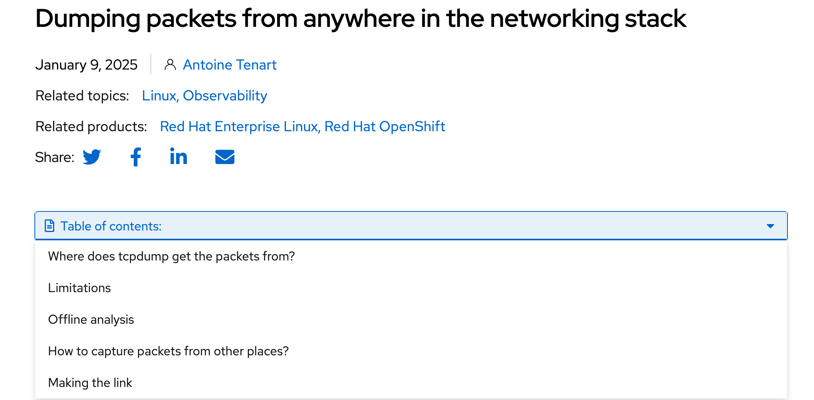

# retis

---

## Red Hat Developer Blog

[Dumping packets from anywhere in the networking stack](https://developers.redhat.com/articles/2025/01/09/dumping-packets-anywhere-networking-stack#)
という記事が話題に

---

## パケットキャプチャ

ネットワークインターフェースからパケットを取得すること

いくつかのツールがある

- tcpdump
- Wireshark
- tshark

---

## 仕組み

[libpcap](https://github.com/the-tcpdump-group/libpcap)を使用

**PF_PACKETソケット**を使用してパケットを取得

- AF_INET
  L3(ネットワーク層)，ユーザ空間
- PF_PACKET
  特殊なソケットタイプ，L2(データリンク層)，カーネル空間

---

## PF_PACKETのキャプチャポイント

1. Ingress
デバイスドライバからネットワークスタックにパケットが渡される直前
ネットワークスタックの前であるため生のデータを取得可能

2. Egress
ネットワークスタックが処理を終えてデバイスドライバにパケットを渡す直前

---

## 制限

#### ネットワークスタックの他の場所からパケットを取得できない

1. Ingress
ファイアウォール(iptables/nftables)やqdisc(tc)で処理されたパケットを見ることはできない

2. Egress
デバイスドライバによる追加の変更後のパケットを見ることはできない

---

## Retis ([retis-org/retis](https://github.com/retis-org/retis))

Linuxネットワークスタックの任意の場所からパケットを取得するためのツール

2023/06/16にv1.0.0がリリース

eBPFを使用してカーネルの関数でフックしてパケットを取得

pcap形式で保存可能

---

## bpftrace ([bpftrace/bpftrace](https://github.com/bpftrace/bpftrace))

eBPFを使用してLinuxカーネルをトレースするツール

DSL(Domain Specific Language)でプローブを指定することで簡単に任意の箇所からトレース可能

カーネル内で実行されるeBPFプログラムはターゲット環境でコンパイルする必要がある

---

## まとめ

- tcpdump や Wireshark は強力なツールだが，キャプチャポイントに制限がある

- Retis や bpftrace は **eBPF** を使用することで任意の場所からパケットを取得可能

- eBPF の登場により，昔はできなかったことが徐々に可能になってきている
